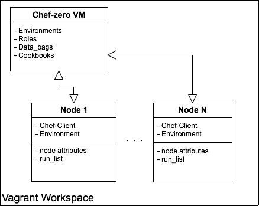

# Vagrant with Chef-zero Example

## Overview




## Requirements

- Vagrant
- vagrant-omnibus(plugin)


## Setup

```
bundle
librarian-chef install
```


## Usage

Prepare chef-zero as Chef-Server.

```
vagrant up chefzero
knife cookbook upload --all
knife upload environments
knife upload roles
```

Regist client and converge it.

```
vagrant up sandbox
```

### Reset chef-zero VM

```
vagrant reload chefzero
knife cookbook upload --all
knife upload environments
knife upload roles
```


## LICENCE

free

Author: SAWANOBORI Yuihiko <sawanoboriyu@higanworks.com>